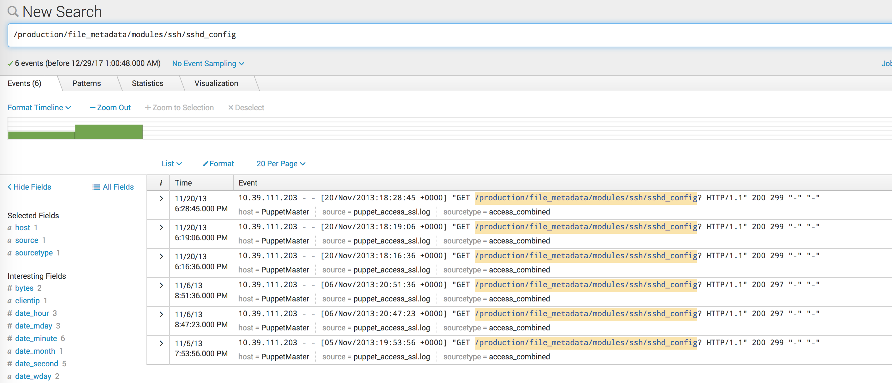
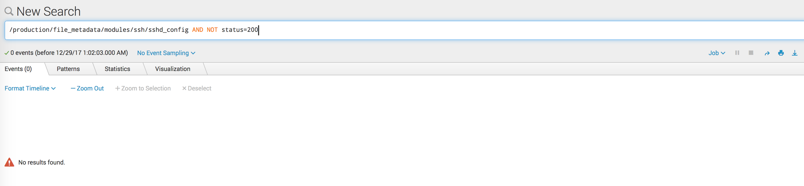
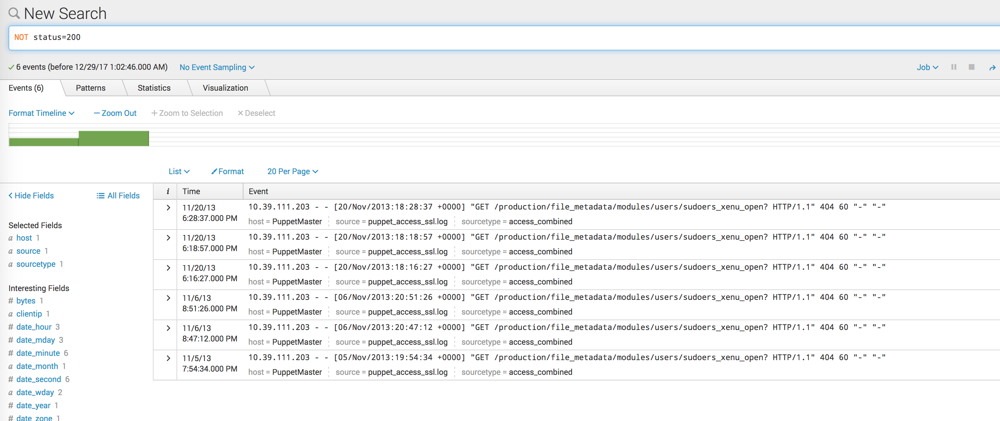
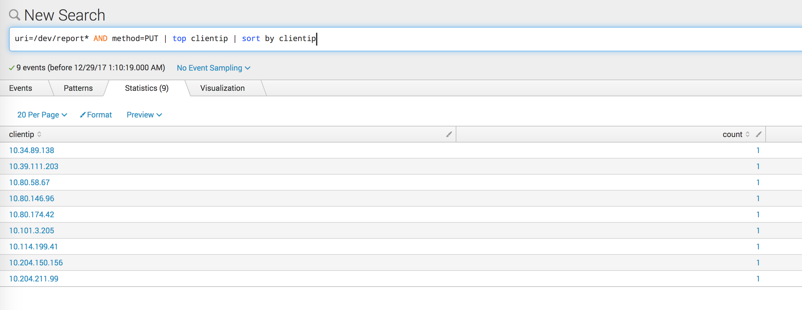

Using Splunk to parse log data
===============

This environment was built in AWS in us-west2 using ami-5b6ca523 on a t2.small.  I did not bother with a dedicated VPC environment, I simply built it in the existing (yet empty) tools VPC.  

Once the instance was started, connect to instance PublicDnsName:8000.  Login is admin/<instance id> .  Use the interface to upload the data file.  It is recognized immediately as an access log.

Analysis:

* one.png shows a simple count of records matching the described URL.  Much like ELK, this is just searching for the string occurance.

    /production/file\_metadata/modules/ssh/sshd\_config

* two.png shows the same search, exlcuding 200 status.  A simple string search with the addition of specifiying that the HTTP *status* field should not be 200.

    /production/file\_metadata/modules/ssh/sshd\_config AND NOT status=200

* three.png shows all entries that are not a status of 200.  By removing the string search, we include all records where the HTTP *status* field is not 200.

    NOT status=200

* four.png shows the count of returned records for /dev/report/* URI strings with PUT requests, plus the breakdown by client address, sorted.  Here we use a glob style wildcard in the *uri* field and specify a value of PUT for the *method* field, then sorted into a top ten values for the *clientip* field (easy way to get the counts associated with the address) and then sorted by *clientip*.  The default would be to sort by occurances.

    uri=/dev/report* AND method=PUT | top clientip | sort by clientip

